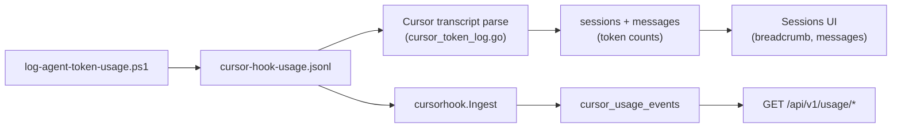

# Cursor hook token usage on all dashboards

## Pre-read (before editing)

- [`docs/agents/storage.md`](docs/agents/storage.md) — non-destructive `ALTER TABLE` only for `session_id`
- [`docs/agents/background-work.md`](docs/agents/background-work.md) — bounded background work; ingest must not block archive writes
- [`docs/agents/testing.md`](docs/agents/testing.md) — `testDB(t)`, testify

## What you see today

| Surface | Data path | Why hook often missing |
|--------|-----------|-------------------------|
| **Sessions** (breadcrumb / messages) | Parse merge in [`internal/parser/cursor_token_log.go`](internal/parser/cursor_token_log.go) | Works when sync re-parses Cursor transcripts after JSONL updates |
| **Usage / token-usage** ([`UsagePage.svelte`](frontend/src/lib/components/usage/UsagePage.svelte)) | `cursor_usage_events` union in [`internal/db/usage.go`](internal/db/usage.go) | Ingest only runs after a **sync pass** — not when JSONL alone grows |
| **Session $ / breakdown** | [`getSessionUsageLegacy`](internal/db/usage.go) via `usageRowSelect()` (messages + `usage_events` only) | Hook billing rows are not in this query today |
| **Analytics heatmap / top sessions** | Session table `total_output_tokens` | Follows parse/resync; usually OK if sessions show tokens |
| **Activity token overlay** | [`GetSessionUsageRows`](internal/db/activityreport.go) — same row source as above | No `cursor_usage_events` |

Admin API rows: account-level, empty `session_id`, `kind != hook` uses reported cost. Hook: `kind = hook`, LiteLLM estimate ([`docs/token-usage.md`](docs/token-usage.md)).

**Filter gate today:** [`usageCursorIncluded`](internal/db/usage_rollup_query.go) delegates to [`cursorUsageRowsSQLForBounds`](internal/db/usage.go), which returns **no cursor rows** when project/machine/branch/session-style filters apply. That is why Usage can look empty even after ingest if the URL carries `project=…` from the sessions app.

---

## Target behavior

1. **Usage (`/usage`) and `/token-usage`:** Cursor hook rows behave like Admin API imports — `agent = cursor`, tokens in totals/time series, **estimated** cost when `kind = hook`.
2. **Timely ingest:** While `agentsview serve` runs, JSONL appends trigger `cursorhook.Ingest` (plus existing post-sync ingest).
3. **Session-attributed surfaces (Phase 2):** Breadcrumb cost/breakdown, Activity, top-sessions, and project-filtered Usage include hook data when `conversation_id` maps to canonical session id **`cursor:{uuid}`** (same as [`CursorSessionID`](internal/parser/cursor.go)), without double-counting global totals.

---

## Phase 1 — Fix Usage dashboard (primary user pain)

**Goal:** User sees hook usage on `/usage` without waiting for a full agent sync.

### 1.1 Hook ingest runner on serve

- New helper under [`internal/cursorhook`](internal/cursorhook) (e.g. `watch.go`):
  - Watch [`UsageLogPath`](internal/cursorhook/paths.go) with debounce (~500ms, same spirit as [`cmd/agentsview/main.go`](cmd/agentsview/main.go) watcher).
  - On fire: run [`Ingest`](internal/cursorhook/ingest.go) with the **same write DB + lock** pattern as sync (`openWriteDB` / daemon write barrier) so inserts are safe alongside sync.
  - Start/stop with serve lifecycle; handle missing file / first create.
  - **Windows:** rely on debounced ingest; append-only JSONL may emit repeated writes — debounce is required.
- Keep post-sync ingest in [`cmd/agentsview/sync.go`](cmd/agentsview/sync.go) and local sync runner.

### 1.2 Tests (Phase 1 exit criteria)

- [`internal/db/usage_test.go`](internal/db/usage_test.go): `TestGetDailyUsageIncludesCursorHookEvents` — `kind = hook`, zero `charged_microdollars`, non-zero tokens, **estimated** priced total.
- Optional: small test that `InsertCursorUsageEvents` + `notifyCursorUsage` path is exercised (existing patterns in usage cache tests).

### 1.3 Manual verification

1. JSONL at `AGENTSVIEW_DATA_DIR/cursor-hook-usage.jsonl`.
2. `agentsview serve` running → Cursor turn → **Usage** with **no project filter**, optional `agent=cursor`.
3. `agentsview usage cursor-hook` reports 0 new rows if daemon already ingested.

**Phase 1 does not require schema changes.** If Usage is still empty, check filters and date window before Phase 2.

---

## Phase 2 — Session linkage and filtered Usage

### 2.1 Schema and canonical session id

- Add `session_id TEXT NOT NULL DEFAULT ''` to `cursor_usage_events` via `ALTER TABLE` ([`internal/db/db.go`](internal/db/db.go)); mirror Postgres/DuckDB push/schema.
- On hook ingest, set `session_id` to **`"cursor:" + strings.TrimSpace(conversation_id)`** when conversation id passes existing hex/UUID validation (replace or fix [`UsageRow.SessionID()`](internal/cursorhook/row.go) — it currently returns bare UUID, which does not match archive session ids).
- **No `cursorhook` → `parser` import:** add a tiny shared helper (e.g. `internal/cursorhook/session_id.go`) or duplicate the `cursor:` prefix constant with a cross-package test against `parser.CursorSessionID`.
- Admin-imported rows keep `session_id = ''`.

### 2.2 Backfill existing hook rows

Dedup prevents re-inserting from JSONL. Add a **one-time backfill** (CLI flag on `agentsview usage cursor-hook` or migration step):

- Read full JSONL (or scan existing rows + match dedup keys).
- `UPDATE cursor_usage_events SET session_id = ? WHERE dedup_key = ? AND kind = 'hook' AND session_id = ''`.

Run once after deploy; document in `docs/token-usage.md`.

### 2.3 Usage SQL and filter gates

- [`dailyCursorUsageRowsSQLTemplate`](internal/db/usage.go): emit `cu.session_id`; `LEFT JOIN sessions s ON s.id = cu.session_id` when non-empty for `project`, `agent`, `machine`.
- **Change [`cursorUsageRowsSQLForBounds`](internal/db/usage.go):** stop excluding all cursor rows when `ProjectFilterLabels()` / machine / branch filters are set. Instead:
  - Rows with `session_id = ''` (admin): still excluded from project-scoped filters (unchanged).
  - Rows with `session_id != ''` (hook): apply filters via session join (same as message rows).
- [`usageCursorIncluded`](internal/db/usage_rollup_query.go) then correctly includes hook data under project filters.

Mirror in [`internal/postgres/usage.go`](internal/postgres/usage.go).

### 2.4 Session-scoped usage union

- Add third branch to [`usageRowsSQLTemplate`](internal/db/usage.go) for `cursor_usage_events` where `session_id != ''`, shaped like `usage_events` branch (tokens in columns, `usage_source = 'cursor'`, join `sessions`).
- Powers [`getSessionUsageLegacy`](internal/db/usage.go), [`GetSessionUsageRows`](internal/db/activityreport.go), and top-sessions ranking.
- Ensure [`usageEventRowTokens`](internal/db/usage.go) / scan path handles `usage_source = 'cursor'` for breakdown and Activity.

### 2.5 Double-counting rule

- **Do not** set message `model` from hook for billing in Phase 2.
- Global Usage totals: hook tokens live in `cursor_usage_events` union + `cursor_usage_facts` only.
- Session views: hook tokens live in the new session-scoped cursor union only.
- Add test: one hook event + synced cursor session → single counted total on `GetDailyUsage` and on `GetSessionUsage` for that session.

---

## Tests and docs (both phases)

| Test | Phase |
|------|-------|
| `TestGetDailyUsageIncludesCursorHookEvents` | 1 |
| Ingest sets `session_id = cursor:{uuid}` | 2 |
| `GetDailyUsage` + project filter includes linked hook row | 2 |
| No double-count daily + session usage | 2 |

- Update [`docs/token-usage.md`](docs/token-usage.md): serve incremental ingest, project filter behavior, backfill command.
- After Go changes: `go fmt ./...`, `go vet ./...`, targeted `go test ./internal/cursorhook/... ./internal/db/... -count=1`.

---

## Out of scope

- Cursor-reported dollars without Admin API.
- Admin/headless rows without local transcript (`session_id` empty).
- Frontend changes unless API contracts change.

---

## Evaluate-and-refine log

- **Iteration 1:** `needs_refinement` — see [`.cursor/reviews/er-cursor-hook-usage-parity-01.md`](.cursor/reviews/er-cursor-hook-usage-parity-01.md)
- **Iteration 2:** `approved` after phasing, canonical session id, filter-gate rewrite, backfill, and removal of ambiguous message-model path.
